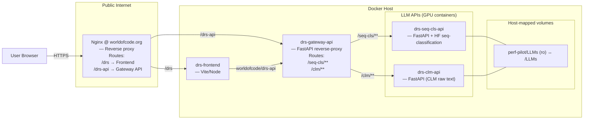

# DRS-LLM
Predicting pull request bug risk score using Llama sequence classification and explainability with Llama text generation. We use Llama 3.1 8B with 4-bit quantization and the implementation is done uging Hugging face Pipeline interface.  

## Architecture



## Testing and Deployment
First modify the env variables in the `drs-llm/deply/prod.env` and test.env. 
The system needs at least two GPUs. Give the cuda device numbers of each one in the env files.

All the services have docker-compose files. When using the compose.sh script, all the compose files are passed in by default so you just have to name services and the environment you want and the docker compose flags you want.

```bash
cd deploy

# Stop running containers
./compose.sh test down

# Bring up only the backend and also build the images in case of new changes
./compose.sh test up -d --build drs-gateway-api

# Bring up the whole stack and also build the images in case of new changes
./compose.sh test up -d --build

# See the merged services
./compose.sh test config --services

# Bring up the whole stack in TEST
./compose.sh test up -d

# Bring up only the backend and remove orphan ocntainers
./compose.sh test up -d drs-gateway-api --remove-orphans

# frontend only
./compose.sh test up -d drs-frontend --no-deps

# Bring up the whole stack with only the seq cls api
./compose.sh test up -d drs-seq-cls-api drs-gateway-api drs-frontend --no-deps

# Bring up PROD
./compose.sh prod up -d --build

# See the fully-resolved config for TEST (great for debugging)
./compose.sh test config

# Tail gateway logs for only gateway api in TEST
./compose.sh test logs -f drs-gateway-api --no-deps

# Build everything
./compose.sh test build --no-cache

```
