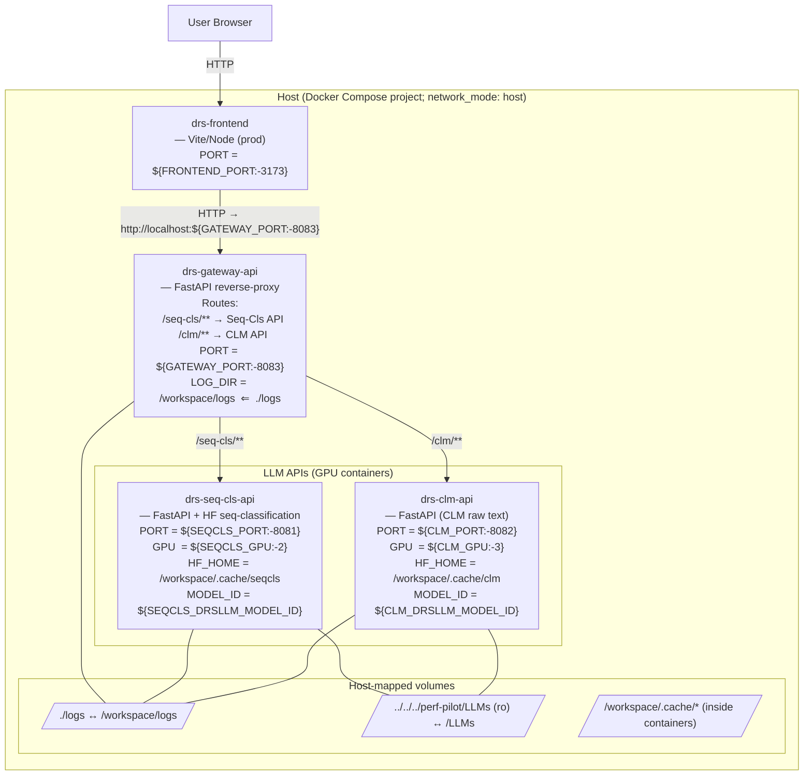

# DRS-LLM


## Architecture



## Testing and Deployment
First modify the env variables in the prod.env and test.env. 
The system needs at least two GPUs the cuda device numbers of which have to be given in the env files.

All the services have compose files. You can build and start them just how you would do with docke compose. When using the compose.sh script, it's the same but all the compose files are passed in by default so you just have to name services and the environment you want.

```bash
cd deploy

# Bring up only the backend and also build the images in case of new changes
./compose.sh test up -d --build drs-gateway-api

# Bring up the whole stack and also build the images in case of new changes
./compose.sh test up -d --build

# See the merged services
./compose.sh test config --services

# Bring up the whole stack in TEST
./compose.sh test up -d

# Bring up only the backend and remove orphan ocntainers
./compose.sh test up -d drs-gateway-api --remove-orphans

# frontend only
./compose.sh test up -d drs-frontend --no-deps

# Bring up only the llm apis
./compose.sh test up -d drs-seq-cls-api drs-clm-api

# Bring up PROD
./compose.sh prod up -d

# See the fully-resolved config for TEST (great for debugging)
./compose.sh test config

# Tail gateway logs for only gateway api in TEST
./compose.sh test logs -f drs-gateway-api --no-deps

```
