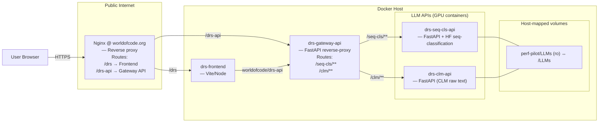

# DRS-LLM
Predicting pull request bug risk score using Llama sequence classification and explainability with Llama text generation. We use Llama 3.1 8B with 4-bit quantization and the implementation is done using Hugging face Pipeline interface.  

## Architecture



## Development and Deployment
First, create a .env file by copying `<drs-llm>/deply/.env.example` and filling in the secrets and other values you might want to change. The .env file has most common env varibales. For more variables you can add to the .env.dev, look at each service's docker-compose file or other .env files in the service source code.
Each DRS LLM API needs at least one GPU. Give the cuda device numbers of each one in the env files.

All the services have docker-compose files. When using the compose.sh script, all the compose files are passed in by default so you just have to name services and the environment you want and the docker compose flags you want. If no services are named, all the services will run.
Services: 
```txt
drs-seq-cls-api, drs-clm-api, drs-gateway-api, drs-frontend, drs-github-app
```

Logs are saved to `<drs-llm>/logs`

```bash
cd deploy

# Stop running containers
./compose.sh down

# Bring up only the backend and also build the images in case of new changes
./compose.sh up -d --build drs-gateway-api, drs-seq-cls-api, drs-clm-api

# Bring up only the seq-cls-api without conflict with other containers
./compose.sh -p test-proj up -d --build drs-seq-cls-api 

# Bring up the whole stack
./compose.sh up -d --build

# See the merged services
./compose.sh config --services

# See the fully-resolved config (great for debugging)
./compose.sh config

# Build everything
./compose.sh build --no-cache

```
